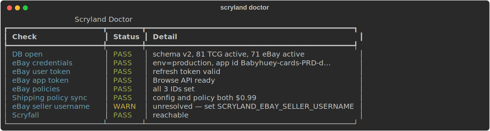
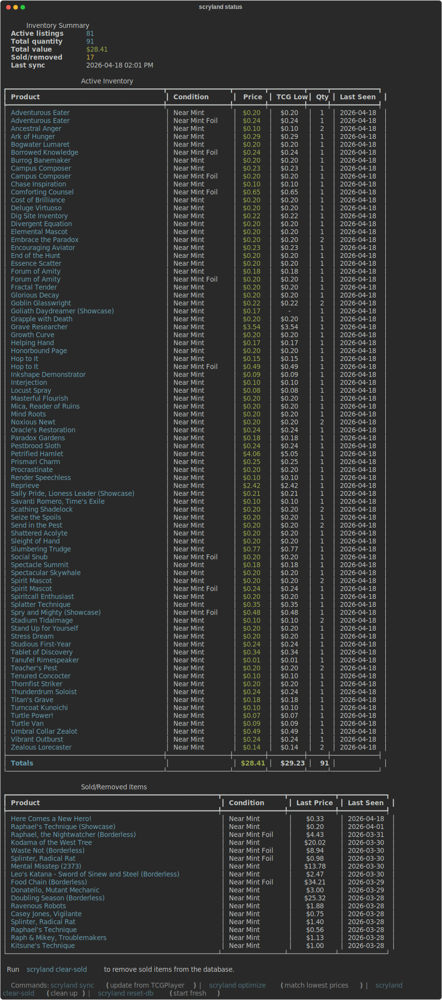
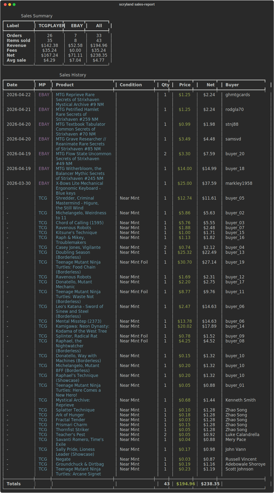

# Scryland

[](https://github.com/babyhuey/scryland/actions/workflows/ci.yml)
[](https://www.python.org)
[](LICENSE)

**Multi-marketplace MTG seller toolkit.** Manages a TCGPlayer seller account (via browser automation) and eBay listings (via the Sell API), keeps prices competitive on both, tracks sales, and auto-delists from the other marketplace when a card sells.

Built because I got tired of manually retrimming 80+ listings every morning.

---

## Screenshots

`scryland doctor` — one-shot health check across DB, eBay credentials, policies, and Scryfall:



`scryland status` — inventory summary + active listings from the local DB (no browser, no API):



`scryland sales-report` — unified sales across TCGPlayer and eBay with net totals:



---

## What it does

- **`scryland optimize`** — walks TCGPlayer's Price Differential Report, matches every listing to the current TCG Lowest. Skips penny listings automatically, prompts on large drops.
- **`scryland list-on-ebay cards.csv`** — publishes a Mythic Tools CSV to eBay with correct condition descriptors, Scryfall images, proper item specifics, and a Browse-API undercut.
- **`scryland watch -i 60`** — runs the full cross-marketplace loop every 60 min: TCG optimize → TCG sales check → eBay undercut sweep → eBay sales check → **auto-delist on the other side when something sells**. Periodically re-scrapes the full TCG inventory (default every 3 days, tunable with `--tcg-refresh-days`) to keep prices fresh for the uncompetitive-gap check.
- **`scryland watch --ebay-only`** — faster API-only loop. Lazy-spawns a browser only when something needs delisted on TCG.
- **`scryland watch --ebay-delist-uncompetitive-gap 0.50`** — also withdraw eBay listings whose price is more than $0.50 above the matching TCG listing (assumes similar shipping). Clears dead-weight listings buyers won't pick over the cheaper TCG copy.
- **`scryland sales`** — scrape TCGPlayer orders, record sales, and immediately withdraw any matching eBay listings. Safe to run standalone after a TCG sale to keep both marketplaces in sync without waiting for the next watch cycle.
- **`scryland compare`** — side-by-side price table across both marketplaces.
- **`scryland doctor`** — one-shot health check.

And a dozen more targeted commands — run `scryland --help`.

---

## Installation

Requires Python 3.11+ and [`uv`](https://docs.astral.sh/uv/).

```bash
git clone https://github.com/babyhuey/scryland
cd scryland
uv sync
uv run playwright install chromium
```

---

## Quick start — TCGPlayer

```bash
# Store your TCGPlayer login (encrypted with a passphrase you pick)
uv run scryland credentials set

# Optional: set the passphrase env var to skip the prompt on every command
export SCRYLAND_PASSPHRASE="your-passphrase"

# Preview price optimization
uv run scryland optimize --dry-run

# Apply it
uv run scryland optimize

# Add cards from a Mythic Tools CSV export
uv run scryland add-inventory cards.csv --skip-lands --min-price 0.25

# Re-list cards you sold previously (DB has them as 'sold' but you own them again)
uv run scryland add-inventory cards.csv --include-sold

# After the run, scryland writes <input>_priced.csv with the real TCG-found
# prices substituted in. Re-run with that file to skip floor cards via the
# existing --csv-min-price pre-filter — no second TCG search needed.
uv run scryland add-inventory cards_priced.csv --csv-min-price 0.10
```

## Quick start — eBay

One-time setup: create a production keyset at [developer.ebay.com/my/keys](https://developer.ebay.com/my/keys). Copy App ID, Cert ID, Dev ID, and create a RuName (any auth-accepted URL will do). Copy `.env.example` to `.env` and fill in the values:

```bash
cp .env.example .env
# Edit .env with your keys
uv run scryland ebay-auth                                   # OAuth consent
uv run scryland ebay-bootstrap \                            # policies + location
    --city Austin --state TX --postal-code 78701
# Paste the 3 policy IDs it prints back into .env
uv run scryland doctor                                      # confirm everything is wired
```

Then list some cards:

```bash
uv run scryland ebay-preview cards.csv -n 3 --undercut      # preview w/o writing
uv run scryland list-on-ebay cards.csv --draft -n 1         # create a draft
uv run scryland list-on-ebay cards.csv -n 1                 # publish live
uv run scryland ebay-refresh-titles                         # re-push titles + aspects
uv run scryland ebay-update-shipping --cost 0.99            # sync policy shipping
```

## Quick start — cross-marketplace loop

```bash
# The good one: every 30 min, handles everything
uv run scryland watch -i 30

# Fast undercut-only mode (no browser; spins one up only when TCG cleanup is needed)
uv run scryland watch --ebay-only -i 10 \
    --ebay-min-price 0.99 \
    --ebay-max-price 50 \
    --ebay-delist-below 0.50 \
    --ebay-delist-uncompetitive-gap 0.50

# Side-by-side comparison of current prices
uv run scryland compare

# Unified sales report across TCG + eBay
uv run scryland sales-report

# Price history for a specific card (both marketplaces)
uv run scryland price-history --card "Reprieve"
```

---

## How the automation works

**Cross-marketplace delist.** Each canonical card maps to a key like `name|set|collector#|condition|foil`. When a sale is recorded on one marketplace, Scryland looks up that key on the other side and ends the listing automatically:

- **Sold on TCG → withdraw eBay offer** via `POST /sell/inventory/v1/offer/{id}/withdraw`. Happens automatically in `scryland watch` and also in `scryland sales` (run it standalone after a TCG sale to sync immediately).
- **Sold on eBay → end TCG listing** by navigating the seller admin, setting quantity to 0, and saving. `watch` handles this; `scryland ebay-sync` is the standalone equivalent.

Ambiguous matches (two printings, same name/condition) refuse to auto-act and log a warning so you can resolve manually.

**Pricing math.** The undercut computes `competitor_total − $0.01 − your_shipping` so the buyer's total (item + shipping) actually beats the competitor's total. eBay's hard $0.99 minimum and your `--min-price` floor both apply.

**Browser flakes.** Playwright-against-TCG is unstable. Every browser-side step goes through a `retry_on_flaky` wrapper that reloads the page on hang, re-tries on stale-handle / execution-context-destroyed errors, and escalates real failures.

**Rate limits.** The eBay HTTP client has a 300/min token bucket + per-sweep semaphore (8 concurrent requests). The undercut sweep fans out Browse queries in parallel, then applies updates in a second parallel phase.

---

## Configuration

All via environment variables or a `.env` file. See `.env.example` for the full list; the most commonly-edited ones:

| Var | Purpose |
|---|---|
| `SCRYLAND_PASSPHRASE` | skip TCG credential prompt |
| `SCRYLAND_EBAY_PASSPHRASE` | skip eBay credential prompt |
| `SCRYLAND_EBAY_ENVIRONMENT` | `production` or `sandbox` |
| `SCRYLAND_EBAY_APP_ID`, `CERT_ID`, `DEV_ID` | from developer.ebay.com |
| `SCRYLAND_EBAY_REDIRECT_URI_NAME` | your RuName (not a URL) |
| `SCRYLAND_EBAY_FULFILLMENT/PAYMENT/RETURN_POLICY_ID` | from `ebay-bootstrap` |
| `SCRYLAND_EBAY_SELLER_USERNAME` | filters own listings from undercut |
| `SCRYLAND_EBAY_SHIPPING_COST` | must match your fulfillment policy |
| `SCRYLAND_MAX_PRICE_CHANGE_PCT` | prompt threshold for large drops |
| `SCRYLAND_NO_DELAYS` | skip cosmetic waits (faster, less human-like) |

## Shipping strategy

Using your own stamp in a plain white envelope means **no seller protection** — an "item not received" claim wipes months of savings. Scryland defaults to **eBay Standard Envelope**:

- ~$0.71 shipping, tracked via QR code
- $20 shipping protection per order (up to $50 combined)
- Cards under $20 only, US domestic only

For cards over $20, change your fulfillment policy in Seller Hub to Ground Advantage (~$4–5 with full tracking + insurance).

---

## Development

```bash
uv sync --extra dev
uv run pre-commit install
uv run pre-commit install --hook-type pre-push

# Tests
uv run pytest              # full suite with coverage
uv run pytest -x           # stop on first failure

# Lint + format
uv run ruff check --fix src/ tests/
uv run ruff format src/ tests/
```

See [CONTRIBUTING.md](CONTRIBUTING.md) for more.

---

## Status & scope

This is a personal tool I ship for my own use. It handles MTG singles on TCGPlayer + eBay. Out of scope:

- Other games (Pokémon, Yu-Gi-Oh)
- Sealed product
- Auto-bidding or sniping
- Anything that violates TCGPlayer or eBay ToS

---

## License

[MIT](LICENSE)

---

## Acknowledgements

- Card data + images: [Scryfall](https://scryfall.com) (CC-BY-NC 4.0)
- Marketplace APIs: [eBay Developer Program](https://developer.ebay.com)
- CSV format: [Mythic Tools](https://mythictools.com)
